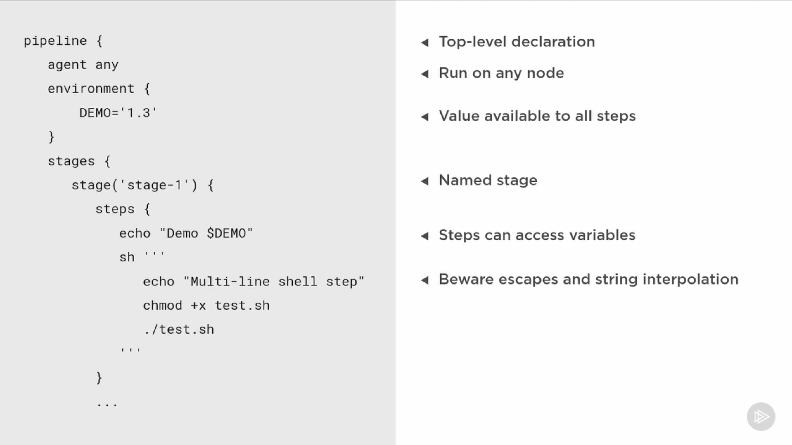
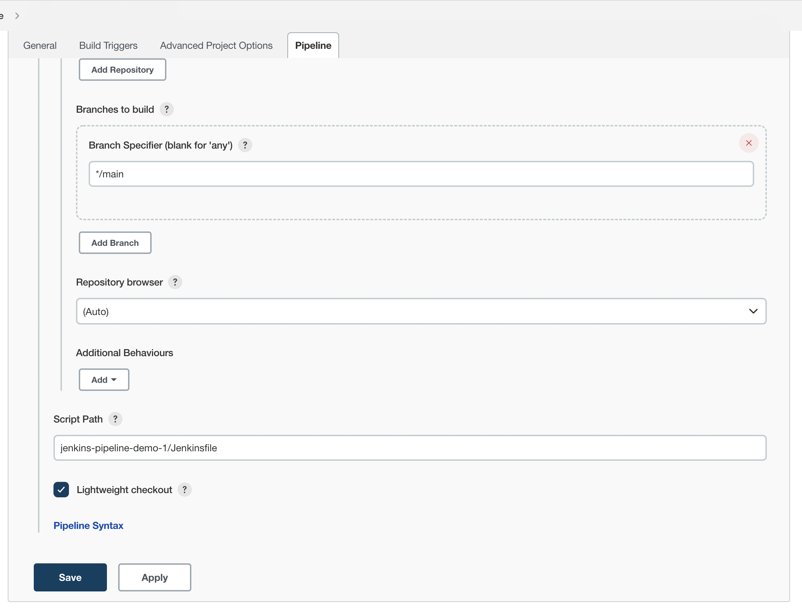

# Overview

Understand jenkins setup, installation, creating declarative pipelines, piplines concepts, plugins etc

# Installation | Docker  

Using [jenkins docker][1] image to setup. 
> docker run --name jenkins-server  -p 8080:8080 -p 50000:50000 jenkins/jenkins:lts


goto http://localhost:8080
follow the instruction for initial password  
install suggested plugins

change password from `Manage jenkins > Users > admin > Configure > Password` admin:admin

setup completed!!

# First Pipeline
1. goto *new item*
2. enter name 'Demo 1' and select *pipeline*
3. goto *pipeline definition* 
4. select *pipeline script* 
5. select *Hello World* on *try sample pipeline* 
6. will see something like below 
```groovy
pipeline {
    agent any

    stages {
        stage('Hello') {
            steps {
                echo 'Hello World'
            }
        }
    }
}
```
> **_NOTE:_** jenkinsfile is kindof groovy script, difference in single and double quote matters as groovy.  
7. save and build now

### update first pipeline   
8. goto *configure* > *pipeline defintion* and add [global environment varibale][4] provided by jenkins 
```groovy 
pipeline {
    agent any

    stages {
        stage('Hello') {
            steps {
                echo "Hello from build: $BUILD_NUMBER"
            }
        }
    }
}
```
9. Save > Build Now > check logs

# second pipeline (using blue ocean)
creating pipeline directly from blue ocean to github repo by integration using access token.
Goto Blue ocean > New pipeline > github > select org > select empty repo > complete
Define pipeline by   
selecting *node* type *any*   
add stage : give stage name  
add action : print message > say echo "my message" 
hit save and run  

# third pipeline (classic jenkins)
Create **New Item** add name *demo 4*   
goto pipeline definition select pipeline from SCM select GIT   
add github url, select default branch name 'main'   
Start pipeline   


#### pipiline structure
    

# declarative pipeline 
is way of saving the pipeline defintion with the code base.  
generally [Jenkinsfile](./jenkins-pipeline-demo-2/Jenkinsfile) stored at root but not limited 
as far as it is defined in jenkins project script path. like below
  

# Pipeline Syntax 
Jenkinsfile is based on groovy script.  
refer [official syntax][5]  
Study of declative pipeline sections are covered [here](./pipeline-sections.md)


# Install Blue Ocean (Optional)
Blue Ocean give next gen UI for the jenkins server.
USP Features like create pipeline steps using graphical UI.
to install goto `Manage jenkins > manage plugins > search "blue ocean" > install and restart`
<!-- Sources and Links -->
[1]: https://hub.docker.com/r/jenkins/jenkins
[2]: https://github.com/jenkinsci/docker/blob/master/README.md
[3]: [jenkins.io/doc/pipeline/steps/]
[4]: [http://localhost:8080/env-vars.html]
[5]: [https://www.jenkins.io/doc/book/pipeline/syntax/#pipeline-syntax]